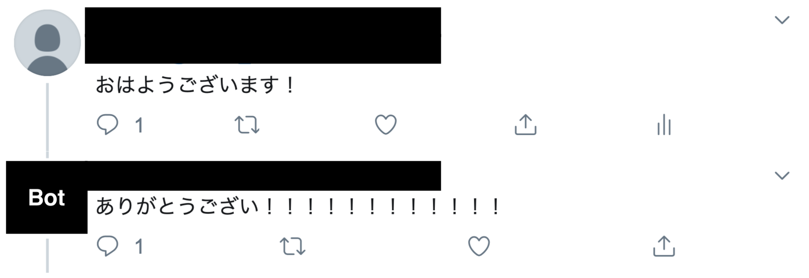

# 目次
* はじめに
* 使ってみたい場合
* 各プログラムの役割
* 動作環境

# はじめに

このプログラムは, PythonとTensorflow-Seq2Seqを用いたTwitter Botです. 

## コードの参照元
本プログラムは以下のサイトを参考に製作しました. <https://github.com/higepon/tensorflow_seq2seq_chatbot> 
Seq2Seqのモデル部分のコードは殆ど同じですが, 主な変更点は以下の通りです. 
1. tensorflow 1.7.0で動作するよう、一部のメソッド参照先の書き換えを行なった
2. ツイートの取得プログラムを自作し、より細かい文章のサニタイズを行なった
3. Threadでリアルタイムにツイートを取得し、同時に返信できるようにした
4. ~~機械音声ライブラリのOpen_jtalkやRospeexを利用し、文章だけでなく機械音声による発話をできるようにした~~

## 注意点
データの取得やサニタイズ処理には改良の余地があります. 
また, Tensorflowはバージョンアップが早く, 過去のバージョンとは関数の参照場所が変わっていて使用できない,  
といった問題が発生しやすいため, 動作環境に従うことを推奨します.

# 使ってみたい場合
## 事前準備
* <https://developer.twitter.com/ja.html>にアクセスし, 電話番号認証済みのTwitter アカウントからAPI Keyを取得する.

  **追記: 利用規約の更新により、API Keyの取得には使用用途などを英語で記載する必要があります.**

## 学習データの取得〜コーパス生成
* tweet_get.pyを実行し, コンソールに取得したいツイート数を入力する. 
  取得したツイートは"$HOME/Seq2Seq_local/data/tweets1M.txt"に保存される.

* data_processer.pyを実行する. 
  tweets1M.txtをもとに, 学習に必要なテキストファイルが"/chatbot_generated"に生成される.

## モデルの学習
* train.pyを実行する. 
  学習のチェックポイントは"$HOME/Seq2Seq_local/chatbot_generated"に保存される.

## モデルの実行
* tweet_replyer.pyを実行する. 
  APIを取得したアカウントにリプライを送ると、Seq2Seqによって生成された文章がリプライとして送られてくる.

# 各プログラムの説明
* **config.py:** 
  ファイルの参照パスやAPIキーの設定を保存する

* **tweet_get.py:** 
  Twitter APIを通して、Twitterに流れるツイートとそのリプライを"/data/tweets1M.txt"に保存する

* **data_processer.py:** 
  tweets1M.txtから、学習に使用するテキストファイルを生成し"/chatbot_generated"に保存する

* **/lib内のpythonファイル:** 
  Seq2Seqのモデル部分. 変更点を除き, 参照元とほぼ同じ

* **train.py**: 
  /chatbot_generatedの各テキストファイルを読み込みSeq2Seqモデルの学習を行う. 
  学習は50stepsずつ行われ, チェックポイントは/chatbot_generatedに保存される
　　　　　　　　
* **predict.py:** 
  生成されたSeq2Seqモデルを用いて会話が行える

* **tweet_listener.py:** 
  APIを取得したユーザーのtimelineのツイートとリプライを取得し、データベースに保存する

* **tweet_replyer.py:** 
  このプログラムを実行している間, APIを取得したアカウントに誰かのリプライが届くと, そのリプライを元に 
  Seq2Seqによって返答を生成し, リプライを返す.

# 動作環境
  * Ubuntu 18.04 LTS
  * Python 3.5.9
  * Tensorflow 1.7.0
  * Tweepy 3.8.0
　
